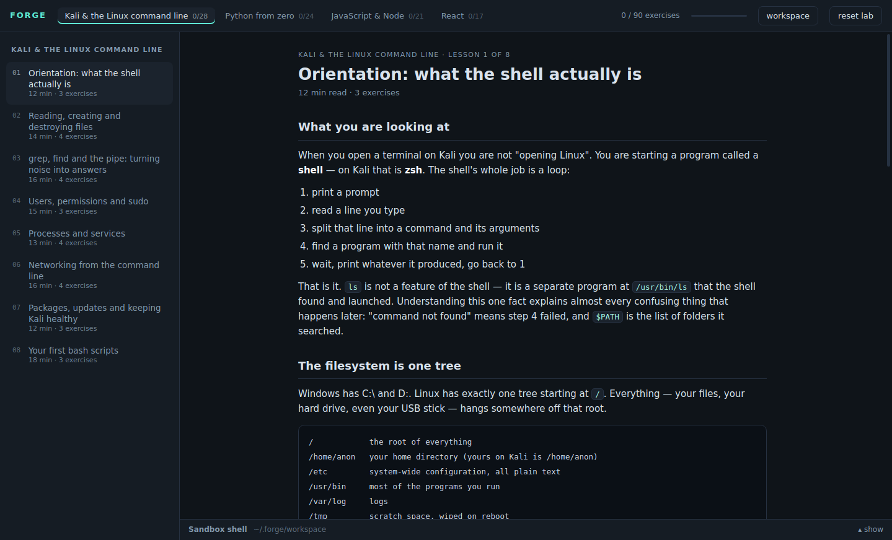
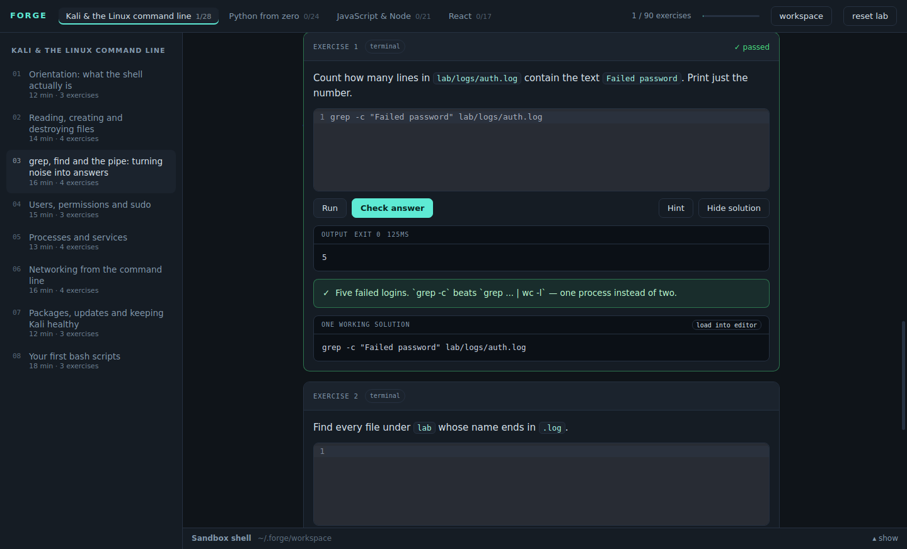
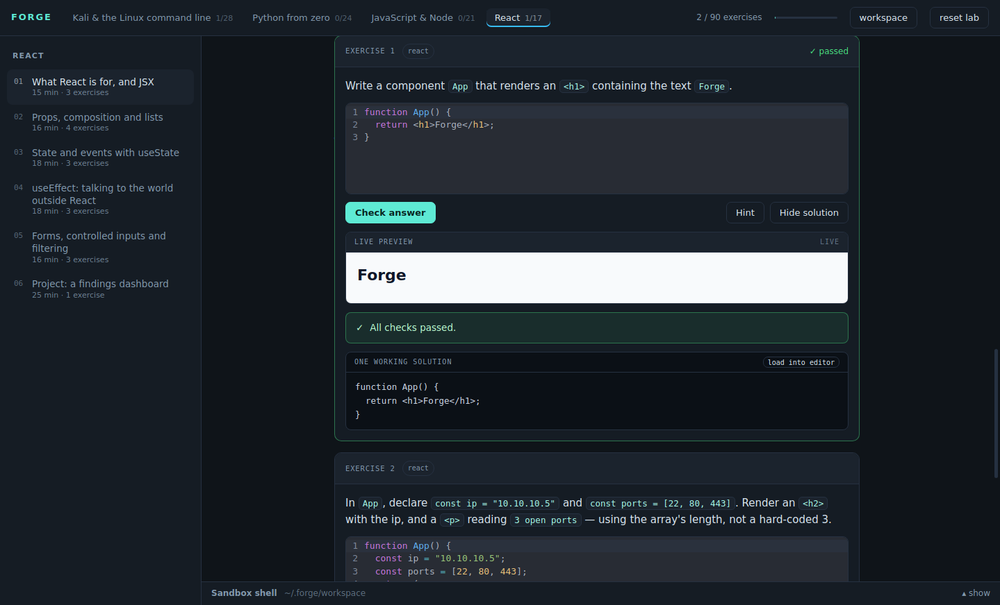

<div align="center">

# Forge

**A desktop app that teaches the Kali Linux command line, Python, JavaScript, Node and React — by making you write code that it actually runs and checks.**

[](https://github.com/__GH_OWNER__/__GH_REPO__/actions/workflows/ci.yml)
[](LICENSE)
[](https://electronjs.org)
[](docs/CURRICULUM.md)
[](docs/CURRICULUM.md)

4 tracks · 29 lessons · 90 graded exercises · no internet needed after install

</div>



---

## What it is

Most learning resources show you code. Forge makes you write it, runs it on your
machine, and checks the result — including the filesystem, not just the output.
Set the wrong permissions on a file and the exercise fails even though the
terminal output looked fine.

| Track | Lessons | Covers |
|---|---|---|
| **Kali & the Linux command line** | 8 | the shell, filesystem, grep/find/pipes, permissions and SUID, processes and systemd, network triage, apt on a rolling distro, bash scripting |
| **Python from zero** | 8 | values, control flow, collections, functions, files and exceptions, modules and venvs, classes, and a log-triage tool you build |
| **JavaScript & Node** | 7 | the language, map/filter/reduce, async and the event loop, the Node runtime, npm and lockfiles, an HTTP API, the same triage tool rebuilt |
| **React** | 6 | JSX, props and keys, `useState`, `useEffect`, controlled forms, a findings dashboard |

**[Full curriculum with every exercise →](docs/CURRICULUM.md)**

All four tracks share one dataset — a small fake SSH auth log in your sandbox.
You solve the same problem with a shell pipeline, then in Python, then in Node.
Seeing one problem in three languages is the fastest way to tell what is
*language* and what is *programming*.

The order is deliberate: Linux first (everything else runs on it), then Python
(the language most of your tooling is written in), then JavaScript (which React
needs), then React.

---

## Install

Built for Kali, works on any Debian-based Linux.

```bash
git clone https://github.com/__GH_OWNER__/__GH_REPO__.git
cd __GH_REPO__
./install.sh
```

That checks your toolchain, installs dependencies, builds the interface, and adds
**Forge** to your application menu. The first run downloads Electron (~180MB),
once.

Launch from the menu, or:

```bash
./forge
```

**Requires** Node 18+ and `python3`. On Kali:

```bash
sudo apt update && sudo apt install -y nodejs npm python3
```

---

## How the exercises work

### Terminal

Your command runs in a real `bash` inside a sandbox. The checker inspects the
output *and the filesystem*.



### Python and Node

Your code runs in a real interpreter with a 10-second timeout, and the checker
compares actual output. An infinite loop is killed as a process group, not left
running.

### React

Your JSX is compiled with Babel, mounted for real, and then the checker **clicks
your buttons and types into your inputs**. A component that looks right but is
not wired up fails.



### Quiz

For the things that are understanding rather than typing — `start` vs `enable`,
why the array index is a bad `key`, what `set -e` prevents. The explanation after
the answer is longer than the question.

### Friction, on purpose

Hints unlock one at a time, increasingly specific. The solution stays behind a
second click, and only becomes prominent after two failed attempts. A failed
attempt teaches more than a read answer.

Your typing is saved as you go, so closing the app mid-exercise costs nothing.

---

## Where your data lives

```
~/.forge/workspace/     the sandbox — lab files, anything you create
~/.forge/progress.json  what you have passed, and your in-progress code
```

Plain files you can read, back up, or copy to another machine. Nothing leaves
your laptop; Forge makes no network requests at all after install.

The **reset lab** button in the top bar wipes and re-creates the lab files if you
break something. It is the only destructive action in the app, and it only ever
touches `~/.forge/workspace`.

### About the sandbox shell

Every command runs as a fresh `bash -lc` inside the workspace:

- `cd` does not persist between submissions — chain with `&&` or use paths.
- Interactive programs (`vim`, `less`, `man`, `top`) will not display, because
  there is no pseudo-terminal attached.

That is a deliberate trade. A true terminal needs `node-pty`, a native module
that must compile against your exact Electron build and is a common cause of
install failures — for features this app does not need, when a real terminal is
one keystroke away.

---

## Read the source — it is the fifth track

Forge is a Node backend and a React frontend, which is exactly what tracks 3 and
4 teach. Once you have finished them, this codebase is a worked example you
already have opinions about. Every file opens with a comment explaining why it is
built the way it is.

**[Full architecture write-up →](docs/ARCHITECTURE.md)**

Three files worth reading first, in order:

1. **`electron/preload.js`** — 30 lines that explain Electron's whole security
   model. The renderer cannot `require()` anything; it gets exactly the nine
   functions listed there and nothing else.
2. **`electron/runner.js`** — `spawn` with `detached: true` so an infinite loop
   can be killed as a process group, output capped so a runaway `print` cannot
   eat your RAM.
3. **`src/components/ReactPreview.jsx`** — compiles your JSX with Babel *in the
   page*, mounts it with its own React root, and asserts against the live DOM.

### In one paragraph

Electron runs two processes. The **main** process is plain Node with full OS
access: it opens the window and is the only thing allowed to touch your
filesystem or spawn programs. The **renderer** is a Chromium page running React
with no OS access at all. They talk over IPC: the renderer calls
`window.forge.submit(...)`, `preload.js` forwards it to a matching
`ipcMain.handle` in `main.js`, and grading happens there. The UI can never mark
itself complete — the same reason you never trust a client to validate its own
input.

---

## Development

```bash
npm install
npm run dev            # hot reload, devtools open
npm start              # build and run the way a user would
npm test               # every reference solution through the real grader
npm run smoke          # launch the real window headlessly, drive the UI, exit 0/1
npm run docs           # regenerate docs/CURRICULUM.md from the lesson files
npm run screenshots    # regenerate docs/images from the running app
```

### Adding your own lessons

Copy a lesson object in `electron/lessons/<track>.js`. The contract is documented
at the top of `electron/lessons/index.js` and in full in
**[CONTRIBUTING.md](CONTRIBUTING.md)**. A `check` function receives
`{ code, result, h }` and returns `{ pass, message }`.

Then prove it is correct:

```bash
npm test
```

That executes the shell commands, runs the Python and Node, compiles and mounts
the React, and fails if any reference solution does not pass its own checker.

It earns its keep: while this app was being built it caught a genuine off-by-one
— the seeded auth log has five `Failed password` lines, but five exercises across
three tracks expected four. Each would have been an unpassable exercise with a
checker insisting on the wrong answer, which is the worst bug a learning tool can
have.

`npm run smoke` covers what a headless suite cannot see: it launches the real
Electron window, calls through the preload bridge, and drives a React exercise to
a pass by clicking through the UI.

---

## Troubleshooting

**Blank white window.** The UI was not built. `npm run build`.

**"The SUID sandbox helper binary is not configured correctly."** Chromium's
sandbox needs unprivileged user namespaces, which some hardened kernels disable.
The `./forge` launcher detects this and retries with `--no-sandbox`
automatically, printing a line when it does.

**A Python or Node exercise says "command not found".** A banner at the top of
the app names the missing interpreter. `sudo apt install -y python3 nodejs`.

**The `ip -br a` exercise fails.** `ip` comes from `iproute2`, standard on Kali.
`sudo apt install -y iproute2`.

**Lab files look wrong.** Click **reset lab** in the top bar.

**Start over completely.** `rm -rf ~/.forge` and relaunch.

---

## Licence

MIT — see [LICENSE](LICENSE). It is yours; modify it.
